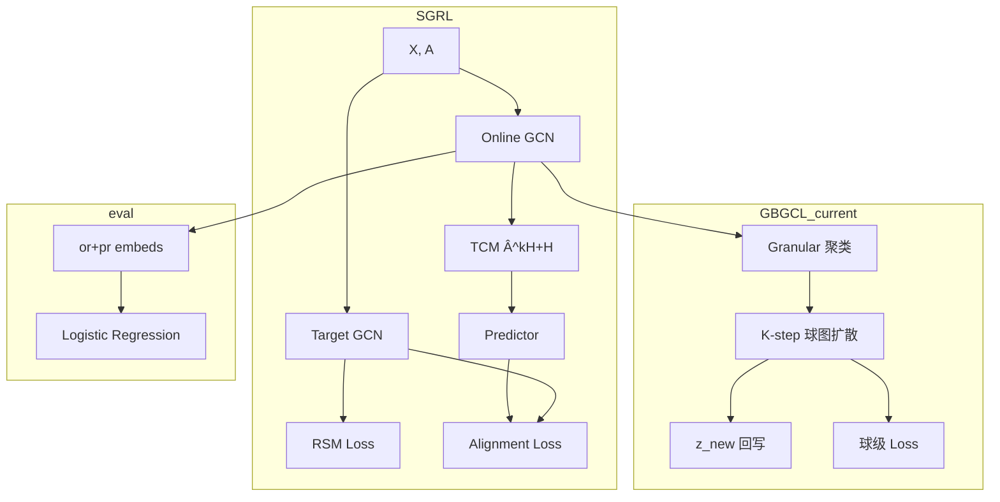

# GBGCL 架构说明（精简版）

> 完整历史版见 `archive/项目系统梳理文档.md`。

## 1. SGRL 基座（`models.py`）

```
Input (X, A)
    ├─ Online: GCN → H_online → TCM: H_topo = Â^k H + H → Predictor → Z_online
    │              loss_align = -cos(Z_online, H_target)
    └─ Target: GCN → H_target → RSM: L_scatter (center-away on hypersphere)
    
每 epoch 末: φ ← τφ + (1-τ)θ  (EMA)
评估: (or_embeds + pr_embeds) → Logistic Regression
```

**TCM**（Eq.5）：`H_online^topology = Â^k H_online + H_online`  
**RSM**（Eq.4）：`L = -mean(||h̃_i - c||²)`，`c = mean(h̃)`

## 2. GBGCL 扩展（`granular.py` + `gb_utils.py` + `train.py`）

在 `use_gb` 且重建/增量 epoch 触发：

```
H (Online 节点嵌入)
    → Granular(quity) → GB_node_list (B 个球)
    → 球心 H0 = mean(球内节点)
    → 球图 W = f(topo边, 球心相似度, w_mode, knn)
    → K 步扩散: H^{t+1} = (1-β)H^t + β D^{-1} W H^t
    → 回写: z_new = α·H + (1-α)·H_ball[node]
    → 球级损失: L_ball_scatter + L_ball_infonce (匈牙利对齐)
```

**增量模式**（`--gb_incremental`）：非重建 epoch 复用 `GB_node_list`，仅更新球心并扩散（`incremental_diffuse_and_write`）。

## 3. 关键代码位置

| 功能 | 文件 | 函数/类 |
|------|------|---------|
| 训练主循环 | `src/train.py` | `train_online()`, `main()` |
| 粒球聚类 | `src/granular.py` | `Granular` |
| 扩散与球损失 | `src/gb_utils.py` | `granule_diffuse_and_write`, `incremental_diffuse_and_write` |
| Ensemble 投票 | `src/gb_utils.py` | `ensemble_granule_build` |
| 特征融合 | `src/models.py` | `Conv.forward` + `gb_feature_concat` |

## 4. 与 SGRL 的接口关系（当前）

```
SGRL 主路径:  BYOL align + Target RSM     ← 始终运行
GBGCL 旁路:  粒球扩散 + 球级 loss         ← use_gb 时叠加

评估路径:     or_embeds + pr_embeds       ← 未使用 z_new（核心缺口）
```

## 5. 目标架构 G-SGRL（见 ROADMAP）

```
Online:  TCM' = Â^k H + γ·z_ball     (BTCM)
Target:  RSM(H_target) + BRSM(H_ball) (分层散射)
粒球:    每 epoch incremental；每 N epoch 重建结构
```

## 6. 主要超参

| 参数 | 默认 | 含义 |
|------|------|------|
| `gb_quity` | detach | 粒球质量：homo/detach/edges/deg/auto |
| `gb_sim` | dot | 球心相似度 |
| `gb_alpha` | 0.6 | 回写时保留原嵌入比例 |
| `gb_beta` | 0.2 | 扩散步混合系数 |
| `gb_K` | 10 | 扩散步数 |
| `gb_w_mode` | topo+center | 球图权重 |
| `gb_rebuild_every` | 50 | 重建粒球间隔 |
| `gb_incremental` | false | 非重建 epoch 增量扩散 |
| `ball_loss_weight` | 0.05 | 球级 scatter 权重 |

## 7. 数据流图



## 8. 数据加载

`src/data.py`：Planetoid / Amazon / Coauthor 等，`T.NormalizeFeatures()`。

| 数据集 | 节点 | 特征维 | 类 |
|--------|------|--------|-----|
| Photo | 7,650 | 745 | 8 |
| Computers | 13,752 | 767 | 10 |
| CS | 18,333 | 6,805 | 15 |
| Physics | 34,493 | 8,415 | 5 |
